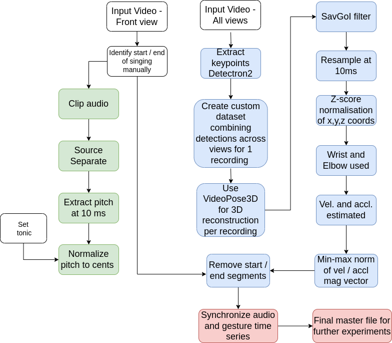

This is the repository for multimodal processing of Hindustani Raga music. 

The dataset consists of recordings by 11 singers (5 Male,6 Female) performing 9 ragas. Each singer has 2 alaps and 1 pakad recording per raga (with a few exceptions). 
| **Singers** | **Ragas** | **Pakad** | **Alap** | **Dur(min)** |
|-------------|----------:|----------:|---------:|-------------:|
| 11(5M,6F)   |         9 |       109 |      199 |          664 |

Singers with the following abbreviations are male:-  CC, AK, MG, MP, NM\
Singers with the following abbreviations are female:- AG, SCh, AP, RV, SS, SM

Following are the ragas used in the recordings. Some ragas are abbreviated.

| **Raga**             | **Abbreviation**          |
|----------------------|--------------------|
| Bageshree      | Bag      |
| Bahar                |     |
| Bilaskhani Todi (Bilas) | Bilas  |
| Jaunpuri (Jaun)      |       |
| Kedar                |     |
| Marwa                |        |
| Miyan ki Malhar (MM) | MM    |
| Nand                 |     |
| Shree                |       |

The metadata for the recording is

|                     | **Metadata Type** | **Metadata**      |
|---------------------|-------------------|-------------------|
| **Audio Metadata**  | Sample Rate       | 48000 Hz          |
|                     | Bit Depth         | 24 bit            |
|                     | Audio Codec       | AAC               |
| **Video Metadata**  | Format            | MP4               |
|                     | Resolution        | 1920*1080         |
|                     | Video Coded       | H.264 High L4.0   |
|                     | FPS               | 24                |

Note that the recordings for singers AG,CC, SCh is at 25 fps.

The mp4 files have a naming convention of <Singer_Name\>\_\<Performance_Type\>\_\<Raga_name\>\_\<View\>.mp4

The repository can process both single-view recordings as well as recordings from multiple views. The following diagrams give the process for 2D and 3D.

|  |  |
|:---:|:---:|
| Processing with front view camera only | Processing with all 3 view cameras |

### Using pre-processed master files

If you want the final processed master file - one per singer - please download them from << INSERT LINK >>

Below is a sample of the master file. Only columns for right wrist are shown here. There would be similar columns for left wrist and both elbows.

| filename     |   time |    pitch |    RWrist_x |   RWrist_y |   RWrist_z |   RWrist_vel_x |   RWrist_vel_y |   RWrist_vel_z |   RWrist_vel_3d |   RWrist_accl_x |   RWrist_accl_y |   RWrist_accl_z |   RWrist_accl_3d |
|:-------------|-------:|---------:|------------:|-----------:|-----------:|---------------:|---------------:|---------------:|----------------:|----------------:|----------------:|----------------:|-----------------:|
| AK_Pakad_Bag |   1    | -177     | -0.0219136  |   0.26221  |   -1.60311 |       -3.37435 |        2.05219 |       -4.45986 |         5.95719 |        -8.6343  |         2.04601 |        0.617001 |          8.89483 |
| AK_Pakad_Bag |   1.01 | -177.75  | -0.00461554 |   0.24789  |   -1.56985 |       -3.29045 |        2.02823 |       -4.44106 |         5.88759 |        -8.90824 |         2.0324  |       -0.399558 |          9.14588 |
| AK_Pakad_Bag |   1.02 | -178.5   |  0.0122338  |   0.235822 |   -1.5374  |       -3.2057  |        2.00511 |       -4.41154 |         5.81022 |        -9.15283 |         2.01253 |       -1.40199  |          9.47576 |
| AK_Pakad_Bag |   1.03 | -179.25  |  0.0291447  |   0.225705 |   -1.5051  |       -3.12038 |        1.98303 |       -4.37169 |         5.72546 |        -9.36834 |         1.98693 |       -2.38643  |          9.86959 |
| AK_Pakad_Bag |   1.04 | -180     |  0.0465709  |   0.216877 |   -1.47157 |       -3.03474 |        1.9622  |       -4.32196 |         5.63376 |        -9.55518 |         1.95621 |       -3.3492   |         10.3124  |
| AK_Pakad_Bag |   1.05 | -180.75  |  0.0647371  |   0.208657 |   -1.43524 |       -2.94903 |        1.94278 |       -4.26285 |         5.53562 |        -9.71388 |         1.92099 |       -4.28677  |         10.7901  |
| AK_Pakad_Bag |   1.06 | -181.5   |  0.0835299  |   0.200628 |   -1.39519 |       -2.86346 |        1.92492 |       -4.19491 |         5.43158 |        -9.84505 |         1.88193 |       -5.19583  |         11.29    |
| AK_Pakad_Bag |   1.07 | -182.25  |  0.102522   |   0.192738 |   -1.35187 |       -2.77824 |        1.90875 |       -4.11874 |         5.32222 |        -9.94939 |         1.8397  |       -6.07324  |         11.8008  |
| AK_Pakad_Bag |   1.08 | -183     |  0.121142   |   0.185186 |   -1.30724 |       -2.69356 |        1.89437 |       -4.03496 |         5.20814 |       -10.0277  |         1.79498 |       -6.91607  |         12.313   |
| AK_Pakad_Bag |   1.09 | -186.823 |  0.138915   |   0.178206 |   -1.26422 |       -2.60957 |        1.88183 |       -3.94418 |         5.08996 |       -10.0809  |         1.74846 |       -7.72163  |         12.8181  |
| AK_Pakad_Bag |   1.10  | -190.646 |  0.155686   |   0.171875 |   -1.22561 |       -2.52643 |        1.87118 |       -3.84703 |         4.96828 |       -10.1098  |         1.70081 |       -8.48741  |         13.3093  |

### Replicating the processing of this repository

On the other hand, if you want to download the raw data and replicate our processing, please follow the following steps.

**Before you start**

Preparation of virtual environment
cd to the directory where you want to install a python virtual environment
```
python -m venv .
source bin/activate
```
Downloading this repository and installing required packages
```
git clone git@github.com:sujoyrc/hindustani_raga_dataset_processing.git
cd hindustani_raga_dataset_processing
pip install -r requirements.txt
```
**Data Processing**

1. Run the following. Set the CAMERA_VIEWS variable to be 'SINGLE_VIEW' or 'MULTIPLE_VIEW'.  The default is MULTIPLE_VIEW
```
export ROOT_DIR=`echo $PWD`
export CAMERA_VIEWS=SINGLE_VIEW
cd ${ROOT_DIR}/00_data/00_orig_video
./download_mp4.sh
```
Ensure download_mp4.sh has execute permission. Note that download_mp4.sh only downloads one sample recording (AK_Pakad_Bag) - the output for that sample file is provided in this repository for reference. 

Rest of the files you need to download from the links below.

**If you are processing with CAMERA_VIEWS=SINGLE_VIEW then follow the steps 2-4**:-


2. Download all the recordings from << INSERT LINK >> . This link has only the front view recordings.
3. Save the recordings in 00_data/00_orig_video
4. Download the json files from << INSERT LINK >> and save them in 01_openpose_output. This will be downloaded as one tar.json.gz file per recording.
  *Alternatively*, create the Openpose json files using the instructions for
   
a) [Openpose Installation](https://github.com/CMU-Perceptual-Computing-Lab/openpose#installation)
   
b) [Openpose Quick Start Overview](https://github.com/CMU-Perceptual-Computing-Lab/openpose#quick-start-overview)
   
These two steps should create a json file per frame per video. Store the json files in `01_json_files`.


**If you are processing with CAMERA_VIEWS=MULTIPLE_VIEW then follow the steps 2-4**:-

2. Download all the recordings from << INSERT LINK >> . This link has the recordings for all 3 views
3. Save the recordings in 00_data/00_orig_video
4. Download the output files of VideoPose 3D from << INSERT LINK >> and save them in `01_VideoPose3D_output`. Alternatively, create the 3D output for VideoPose3D by following the instructions in [VideoPose3D: Inference in the Wild](https://github.com/facebookresearch/VideoPose3D/blob/main/INFERENCE.md). Note that each recording with the detections of 3 views should be made into a separate custom dataset.
.
   

6. Download the start and end times from << INSERT LINK >>. This is present for most videos (except those by singers AG, CC, SCh) and has the start and end time of the actual performance. There is one text file per performance and has the start time and end time.
   Save the start and end times in directory 00_data/01_start_and_stop_times

7. Run the following

  ```
   cd ${ROOT_DIR}/02_audio_processing
   ./extract_audio.sh
   ./process_audio.sh
   ```
  
   Ensure the .sh files have execute (+x) permission for user in question.

   The output of this process will create the pitch contours at 10 ms intervals. Unvoiced segments less than 400 ms are interpolated by a linear interpolation.
   There will be a separate output csv file for each recording present in 00_data/00_orig_video
   
7. Run the following. This code will use the CAMERA_VIEWS variable.
    ```
    cd ${ROOT_DIR}/04_video_processing
    ./run_gesture_keypoint_extraction.sh
    ```
   Ensure the .sh files have execute (+x) permission for user in question.


   This process will create the gesture coordindates for each keypoint.
   There are three output folders in this processing:-
   
   a) keypoints_non_normalized - this has one file per recording having all 25 Openpose keypoints in pixel coordinates
   
   b) keypoints_all - this has one file per recording having all 25 Openpose keypoints followed by z-score normalization
   
   c) pose_keypoints_dir - this has one file per recording having only the keypoints for wrist and elbow of both hands. This is the only data used in the next step

10. Run the following
     ```
     cd ${ROOT_DIR}/06_multimodal_processing
     python process_multimodal_data.py
     ```

     This process does the following:-
     
     a. Computes velocity (V) and accelaration (A) by a 101 point biphasic filter on the position (P) coordinates of keypoints of interest. The document [Velocity and acceleration processing](https://drive.google.com/file/d/1YmyQaPJNU_IZqVz9ztMsMjrFztecFcDp/view?usp=sharing) has the details of the biphasic filter and the velocity and acceleration computation.
     
     b. Using the start and end times (where relevant) removes gesture information outside start and end time intervals and resets the time for the gesture information to zero corresponding to the start time. Then it combines the pitch and gesture for a certain video information based on the adjusted time.
     
     c. Creates a master file per singer containing the gesture information (P+V+A) aligned with the pitch at 10ms intervals.
   
