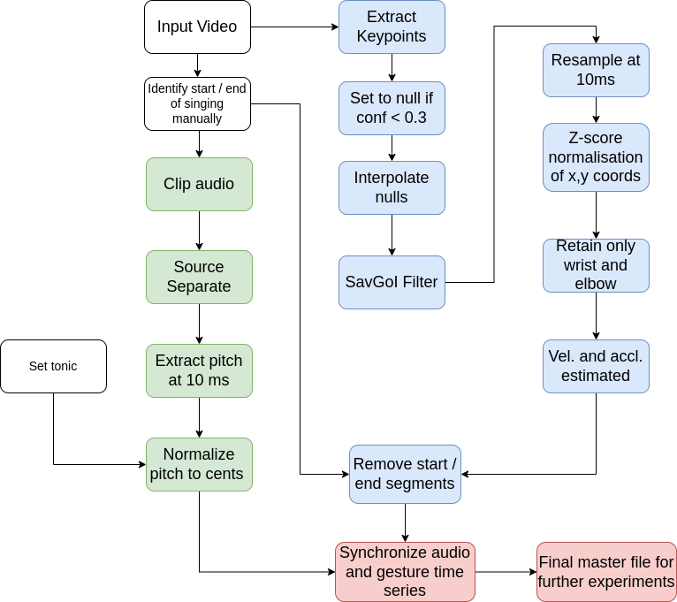

Contents

[**Summary of Contents of repository......................................................................................................................................2** ](#_page1_x72.00_y72.00)[Dataset Details........................................................................................................................................................................4** ](#_page3_x72.00_y72.00)[Metadata For The Recording................................................................................................................................................. 6** ](#_page5_x72.00_y72.00)[Processing Flowcharts...........................................................................................................................................................8** ](#_page7_x72.00_y72.00)[Audio Processing and Pitch Extraction................................................................................................................................9** ](#_page8_x72.00_y72.00)[Part 1: From Raw Audio to Source Separated Audio......................................................................................................... 9 ](#_page8_x72.00_y122.29)[Part 2: From Source Separated Audio to Pitch Contours..................................................................................................11 ](#_page10_x72.00_y324.18)[**Video Time Series Processing.............................................................................................................................................13** ](#_page12_x72.00_y72.00)[SavGol Filter, Resampling and Z-Score Normalization.....................................................................................................13 ](#_page12_x72.00_y118.99)[Velocity and Acceleration Estimation................................................................................................................................13 ](#_page12_x72.00_y164.15)[**Using processed master files..............................................................................................................................................14** ](#_page13_x72.00_y72.00)[Replicating the processing of this repository....................................................................................................................17** ](#_page16_x72.00_y101.84)[Before you start.................................................................................................................................................................17 ](#_page16_x72.00_y189.96)[Data Processing................................................................................................................................................................17](#_page16_x72.00_y412.90)

This is the code repository for multimodal processing of Hindustani Raga music. It covers the chain of processing as well as intermediate outputs for the following overall task: Set of Videos (mp4) of raga alap (or pakad) by a singer across 9 ragas are processed to obtain a CSVMasterfile containing the time series (sampled at 10 ms intervals) of singer pitch (cents with reference to singer tonic), gesture (3d position, velocity, acceleration) from selected keypoints (elbow, wrist). We eventually present: One per-singer: Masterfile, offsets info file linking video

timestamps with masterfile timestamps and singer tonic.

Summary of Contents of repository

|00\_data|This is the data folder containing the original videos, text file for each singer with the start and stop times for the actual singing in each video and the singer specific tonic.|
| - | :- |
|01\_json\_files|This is the output of 2D coordinates from the OpenPose processing using the front view only.|
|01\_videopose\_output|This is the output of the 3D coordinates from VideoPose3D library. This uses all the 3 views of the recording.|
|02\_audio\_processing|This has the code for the processing of the audio|
|03\_audio\_processing\_output|This is where the audio processing code places its output|
|04\_video\_processing|This is the location for the video processing code (SavGol filtering, 10 ms resampling, and Z-score normalization) which converts the output of either OpenPose or VideoPose3D into time series at 10ms intervals|

|05\_video\_processing\_output|This is where the video processing code places its output|
| - | - |
|06\_multimodal\_processing|This is the location of code for the computation of velocity and acceleration and combination of audio and video processing output|
|07\_multimodal\_processing\_output|This is where the masterfile (output of above processing) is stored.|

Dataset Details

The dataset consists of recordings by 11singers (5 Male,6 Female) performing 9 ragas. Each singer has 2 alaps and 1 pakad recording per raga (with a few exceptions).

|**Singer**|**Gender**|**Ragas**|**#Pakad**|**#Alap**|**Dur(min)**|
| - | - | - | - | - | - |
|AG|F|9|9|17|54|
|AK|M|9|9|18|60|
|AP|F|9|9|18|59|
|CC|M|9|10|18|71|
|MG|M|9|9|18|58|
|MP|M|9|9|18|59|
|NM|M|9|9|18|55|
|RV|F|9|9|18|60|
|SCh|F|9|18|20|67|
|SM|F|9|9|18|60|
|SS|F|9|9|18|60|
|**All**|**5M,6F**|**9**|**109**|**199**|**664**|

Tonic per singer is present in text files in 00\_data/03\_singer\_specific\_tonic Following are the ragas used in the recordings. Some raga names are abbreviated.

|||||
| :- | :- | :- | :- |
|||||
|||||
|||||
|||||
|||||
|||||
|||||
|||||
|||||
|||||

|**Raga**|**#Pakad**|**#Alap**|**Duration**||
| - | - | - | - | :- |
|Bageshree (Bag)|12|22|73||
|Bahar|12|22|70||
|Bilaskhani Todi (Bilas)|13|22|73||
|Jaunpuri (Jaun)|12|22|72||
|Kedar|12|22|72||
|Marwa|12|22|76||
|Miyan ki Malhar (MM)|12|23|78||
|Nand|12|22|74||
|Shree|12|22|75||
|**ALL**|**109**|**199**|**664**||
||||||
||||||
Audiovisual Recording Format

|**Audio Metadata**|Sample Rate|48000 Hz|
| - | - | - |
||Bit Depth|24 bit|
||Audio Codec|AAC|

|**Video Metadata**|Format|MP4|
| - | - | - |
||Resolution|1920\*1080|
||Video Coded|H.264 High L4.0|
||FPS|24|

||||
| :- | :- | :- |
||||
||||
||||
For every singer we also provide a tonic file containing the tonic for the singer. This is provided in 00\_data/02\_singer\_specific\_tonic

The repository can process both single-view recordings as well as recordings from multiple views. The following diagrams give the process for 2D and 3D. We use [OpenPose f](https://github.com/CMU-Perceptual-Computing-Lab/openpose)or keypoint estimation from front view only and [VideoPose3D ](https://github.com/facebookresearch/VideoPose3D)for keypoint extraction from 3 views.

Processing Flowcharts

` `

Processing with front view camera only Processing with all 3 view cameras

Audio Processing and Pitch Extraction

Part 1: From Raw Audio to Source Separated Audio

For Durham singers (AG, CC, SCh) we used **Spleetersource separation** (4 stem model) ([https://research.deezer.com/projects/spleeter.html)](https://research.deezer.com/projects/spleeter.html)

For Pune singers (AK, AP, MG, MP, NM, RV, SM, SS) we used **Audacity Noise Removal** (called ANRhereupon) – the parameters are mentioned in the following explanation

This choice was made based on some trial and error. We had three choices to do the source separation:

1) Using Spleeter Only
1) Using ANRonly
1) Using ANRfollowed by Spleeter (ANR+Spleeter)

The drawback of using Spleeter was that some portion of the vocals was getting lost because of aggressive source separation. The drawback of using ANRwas that it was not as effective as Spleeter in removing the accompaniment (Tanpura). So we had a tradeoff.

We noticed the following:

**Pune Singers:**

For SM, the voice was loud enough so ANRwas working well. But it was not working better than Spleeter. For other Pune Singers ANR is working worse than Spleeter. So for new singers, using Spleeter only was the best. Audacity noise removal is not giving any improvement, irrespective of whether we use Spleeter or not. Because of the loud tanpura, we need the aggressive splitting of Spleeter to get the separated vocals.

**Durham Singers:**

For Durham singers, low pass filtering followed by noise removal was working well. After than we could use Spleeter in order to be extra sure or we could do without it as well (the difference was negligible). For CC and AG, ANRonly and ANR+Spleeter were working much better than Spleeter only. For SCh the difference is not so significant. The tanpura is soft enough so that all methods give decent pitch contours but ANRis still better than Spleeter.

Steps in ANR:

1. Low pass filter (2400 Hz, 48 dBroll off) using Audacity:
1. Noise removal:

The noise profiles and parameter values chosen are mentioned later. For details on how to use Audacity Noise Removal, check this page: <https://manual.audacityteam.org/man/noise_reduction.html>

For AG and CC, ANRonly worked the best. For SCh, all three were similar. So for old singers we used ANRonly, to not risk losing the vocals because of Spleeter.

So for Durham singers the pipeline is:

1. Filtering using lowpass filter of 2400 Hz cutoff and 48 dBrolloff (in Audacity: Effects → EQ and Filters → Low-pass filter) For steps 2 and 3: (Effects → Noise Reduction and Repair → Noise Reduction)
1. Choose noise profile: (note: noise profile is chosen after filtering, not before)
1. Noise removal

Based on trial-error and tuning the parameters, the noise profiles and parameters chosen finally, for the Durham singers were: **Singer Noise Sensitivity Frequency Noise Profile (forragas except Noise profile (forBageshri) 

**Reduction smoothing Bageshri)**

**(dB) (bands)**

**AG** 12 4 0 AG\_Aalap2\_MM – 0 to 4.6s AG\_Aalap2\_Bag – 0 to 2.9s

|||||||
| :- | :- | :- | :- | :- | :- |
|**CC**|18|4|0|CC\_Aalap2\_Bahar – 0 to 4.8s|CC\_Aalap1\_Bag – 0 to 5.2s|
|**SCh**|12|4|0|SCh\_Aalap1\_Shree – 0 to 4.5s|SCh\_Aalap2\_Bag – 3 min 7.0 s to 3 min 12.3 s|

**\***The reason for using different noise profiles for Bageshri was that in Bageshri the tanpura is played in cycles of Sa-Ma instead of Sa-Pa. Hence, the spectra of tanpura in raga Bageshri is different than that in other ragas.

Using this, we got the source separated audios, which are stored in the folder Source\_Separated\_Audios under two subfolders:

- Old\_Singers\_ANR: Durham singer audios separated using Audacity Noise Removal
- New\_Singers\_Spleeter: Pune singer audios separated using Spleeter

Part 2: From Source Separated Audio to Pitch Contours

Once we have the source separated audio, we use the Python APIfor Praat software, namely Parselmouth, to derive the pitch contour from the audio using filtered autocorrelation method. Parselmouth pitch detector has several parameters that can be tuned for increased accuracy of the pitch contour. Based on extraction performance and comparison with the audio done by manual listening to the sonified contour, we found that the following values (see table) worked best on our audios. The tonic is fixed for a given singer, the other parameters are tuned. The tuning was done mainly with the intention to avoid octave errors and false silences (regions which are actually voiced but predicted wrongly as silences).

|**Singer**|**Pitch Min (Hz)**|**Tonic**|**Pitch Max (Hz)**|**Silence Threshold**|**Voicing Threshold**|**Octave Cost**|**Octave Jump Cost**|**Voiced/Unvoiced Cost**|
| - | - | - | - | :- | :- | :- | :- | :- |
|(Praat Standard)|50|**-**|800|0\.09|0\.50|0\.055|0\.35|0\.14|
|AK/MP/ NM/MG|80|**146.8**|600|0\.001|0\.01|0\.01|20|10|
|CC|70|**138.6**|560|0\.01|0\.01|0\.1|20|10|
|AG|125|**207.7**|880|0\.01|0\.01|0\.1|10|10|
|SCh|150|**246.9**|900|0\.001|0\.01|0\.1|10|10|
|SS|150|**220.0**|800|0\.01|0\.001|0\.1|20|10|
|SM/RV/AP|150|**220.0**|800|0\.0001|0\.0001|0\.1|20|10|

Attenuation at ceiling: 0.03 for all

The main steps in pitch extraction were:

1) Parselmouth pitch extraction at 10 ms intervals on source separated audio using above parameter values
1) Linear Interpolation of silences less than 400 ms

The code for these steps is present in the file extract\_pitch\_contours.py

Instructions to run the script:

1) In the file extract\_pitch\_contours.py, change the variables INPUT\_FOLDER, OUTPUT\_FOLDERand FILEaccording to your directory structure. INPUT\_FOLDERshould contain the audio file that is to be pitch-extracted, and OUTPUT\_FOLDERshould be a folder where the csv file of pitch contour is to be stored.
1) Run the script using the command:

   python extract\_pitch\_contours.py

The interpolated pitch contour will be saved as a csv file in OUTPUT\_FOLDER

Video Time Series Processing

SavGol Filter, Resampling and Z-Score Normalization Velocity and Acceleration Estimation

Using the processed master files

If you wish to access directly the final processed master files - one per singer - please download them from << INSERTLINK>>

Below is a sample of the master file. Only columns for right wrist are shown here. There would be similar columns for left wrist and both elbows.

|**filename**|**time**|**pitch**|**RWrist\_x**|**RWrist\_y**|**RWrist\_z**|**RWrist\_vel \_x**|**RWrist\_v el\_y**|**RWrist\_vel \_z**|**RWrist\_v el\_3d**|**RWrist\_ac cl\_x**|**RWrist\_a ccl\_y**|**RWrist\_accl \_z**|**RWrist\_a ccl\_3d**|
| - | - | - | - | - | - | -: | -: | -: | -: | -: | -: | -: | -: |
|AK\_Pakad\_Bag|1|-177|-0.021913|0\.26221|-1.60311|-3.37435|2\.05219|-4.45986|5\.95719|-8.6343|2\.04601|0\.617001|8\.89483|
|AK\_Pakad\_Bag|1\.01|-177.75|-0.004615|0\.24789|-1.56985|-3.29045|2\.02823|-4.44106|5\.88759|-8.90824|2\.0324|-0.399558|9\.14588|
|AK\_Pakad\_Bag|1\.02|-178.5|0\.012233|0\.235822|-1.5374|-3.2057|2\.00511|-4.41154|5\.81022|-9.15283|2\.01253|-1.40199|9\.47576|
|AK\_Pakad\_Bag|1\.03|-179.25|0\.029144|0\.225705|-1.5051|-3.12038|1\.98303|-4.37169|5\.72546|-9.36834|1\.98693|-2.38643|9\.86959|
|AK\_Pakad\_Bag|1\.04|-180|0\.04657|0\.216877|-1.47157|-3.03474|1\.9622|-4.32196|5\.63376|-9.55518|1\.95621|-3.3492|10\.3124|
|AK\_Pakad\_Bag|1\.05|-180.75|0\.064737|0\.208657|-1.43524|-2.94903|1\.94278|-4.26285|5\.53562|-9.71388|1\.92099|-4.28677|10\.7901|
|AK\_Pakad\_Bag|1\.06|-181.5|0\.083529|0\.200628|-1.39519|-2.86346|1\.92492|-4.19491|5\.43158|-9.84505|1\.88193|-5.19583|11\.29|
|AK\_Pakad\_Bag|1\.07|-182.25|0\.102522|0\.192738|-1.35187|-2.77824|1\.90875|-4.11874|5\.32222|-9.94939|1\.8397|-6.07324|11\.8008|
|AK\_Pakad\_Bag|1\.08|-183|0\.121142|0\.185186|-1.30724|-2.69356|1\.89437|-4.03496|5\.20814|-10.0277|1\.79498|-6.91607|12\.313|
|AK\_Pakad\_Bag|1\.09|-186.823|0\.138915|0\.178206|-1.26422|-2.60957|1\.88183|-3.94418|5\.08996|-10.0809|1\.74846|-7.72163|12\.8181|
|AK\_Pakad\_Bag|1\.1|-190.646|0\.155686|0\.171875|-1.22561|-2.52643|1\.87118|-3.84703|4\.96828|-10.1098|1\.70081|-8.48741|13\.3093|

There are two sets of master files provided – one set using the OpenPose based 2D processing and one set using the VideoPose3D based 3D processing.

We provide one master file per singer. The joint names are RWrist, LWrist, RElbow and LElbow for right wrist, left wrist, right elbow, left elbow respectively

The master files have the following columns:-

|**Content**|**No. of cols**|**Column names and Description**|
| - | - | - |
|Filename|1|**filename** <Singer\_Name>\_<RecordingType>\_<Raga>e.g. AK\_Pakad\_Bag|
|Time|1|**time** in seconds starting at offset start time|
|Pitch|1|**pitch** in cents|
|Position coordinates|3\*4|**<JointName>\_x, <JointName>\_y, <JointName>\_z** for joint position for each of the joints. \_z values are 0 for the 2D master file|
|Velocity coordinates|3\*4|**<JointName>\_vel\_x, <JointName>\_vel\_y, <JointName>\_vel\_z** for joint velocity for each of the joints. \_z values are 0 for the 2D master file|
|Acceleration coordinates|3\*4|**<JointName>\_accl\_x, <JointName>\_accl\_y, <JointName>\_accl\_z** for joint acceleration for each of the joints. \_z values are 0 for the 2D master file|
|Velocity magnitude|1\*4|**<JointName>\_vel\_mag** for Euclidean magnitude of velocity and acceleration for each of the joints|
|Acceleration magnitude|1\*4|**<JointName>\_accl\_mag** for Euclidean magnitude of velocity and acceleration for each of the joints|
|**Total Numberof columns**|**47**||
Note: Position coordinates are z-score normalized over the entire recording. There is no normalization done for velocity and acceleration columns.

Replicating the processing of this repository

On the other hand, if you want to download the raw data and replicate our processing, please follow the following steps.

Before you start

Preparation of virtual environment cd to the directory where you want to install a python virtual environment

python -m venv .

source bin/activate

Downloading this repository and installing required packages

git clone git@github.com:sujoyrc/hindustani\_raga\_dataset\_processing.git cd hindustani\_raga\_dataset\_processing

pip install -r requirements.txt

Data Processing

1\. Run the following. Set the CAMERA\_VIEWS variable to be '2D' or '3D'. The default is 3D

export ROOT\_DIR=`echo $PWD` export CAMERA\_VIEWS=3D

cd ${ROOT\_DIR}/00\_data/00\_orig\_video

./download\_mp4.sh

Ensure download\_mp4.sh has execute permission. Note that download\_mp4.sh only downloads one sample recording (AK\_Pakad\_Bag) - the output for that sample file is provided in this repository for reference.

Rest of the files you need to download from the links below.

**If you are processing with CAMERA\_VIEWS=2D then follow the steps 2a-4a**:-

2a. Download all the recordings from <<INSERTLINK>>. This link has only the front view recordings. 3a. Save the recordings in 00\_data/00\_orig\_video 4a. Download the json files from <<INSERTLINK>>and save them in 01\_openpose\_output. This will be downloaded as one tar.json.gz file per recording. *Alternatively*, create the Openpose json files using the instructions for

[Openpose Installation ](https://github.com/CMU-Perceptual-Computing-Lab/openpose#installation)[Openpose Quick Start Overview](https://github.com/CMU-Perceptual-Computing-Lab/openpose#quick-start-overview)

These two steps should create a json file per frame per video. Store the json files in 01\_json\_files. **If you are processing with CAMERA\_VIEWS=3D then follow the steps 2b-4b**:-

2b. Download all the recordings from <<INSERTLINK>>. This link has the recordings for all 3 views 3b. Save the recordings in 00\_data/00\_orig\_video 4b. Download the output files of VideoPose 3D from <<INSERTLINK>>and save them in 01\_videopose\_output.

*Alternatively*, create the 3D output for VideoPose3D by following the instructions in V[ideoPose3D: Inference in the Wild.](https://github.com/facebookresearch/VideoPose3D/blob/main/INFERENCE.md) Note that each recording with the detections of 3 views should be made into a separate custom dataset. .

6. Download the start and end times from <<INSERTLINK>>. There is one text file per performance and has the start time and end time of the actual performance - excluding any leading announcements and silence at the end. Save the start and end times in directory 00\_data/01\_start\_and\_stop\_times
6. Run the following

cd ${ROOT\_DIR}/02\_audio\_processing ./extract\_audio.sh

./process\_audio.sh

Ensure the .sh files have execute (+x) permission for user in question.

The output of this process will create the pitch contours in cents at 10 ms intervals. Unvoiced segments less than 400 ms are interpolated by a linear interpolation. Conversion from Hz to cents is done based on the tonic files in 00\_data/03\_singer\_specific\_tonic. There will be a separate output csv file for each recording present in 00\_data/00\_orig\_video

Note that this does not do the separate audacity based processing (source separation) for 3 singers - AG / CC / SCh. If you would like to do this follow the instructions in [ReadMePitchExtraction.docx f](https://github.com/sujoyrc/hindustani_raga_dataset_processing/blob/main/ReadmePitchExtraction.docx)or these singers.

7\. Run the following. This code will use the CAMERA\_VIEWS variable.

8\.cd ${ROOT\_DIR}/04\_video\_processing 9../run\_gesture\_keypoint\_extraction.sh

Ensure the .sh files have execute (+x) permission for user in question.

This process will create the gesture coordinates for each keypoint. There are three output folders in this processing:-

1) 00\_keypoints\_non\_normalized - this has one file per recording having all 25 Openpose keypoints in pixel coordinates
1) 01\_keypoints\_all - this has one file per recording having all 25 Openpose keypoints followed by z-score normalization
1) 02\_keypoints\_selected - this has one file per recording having only the keypoints for wrist and elbow of both hands. This is the only data used in the next step

Note that we do not have the same set of keypoints in 2D and 3D. The details are provided in K[eypoint Details](https://github.com/sujoyrc/hindustani_raga_dataset_processing/blob/main/KeypointDetail.xlsx)

10\.Run the following

11. cd ${ROOT\_DIR}/06\_multimodal\_processing
11. python process\_multimodal\_data.py

This process does the following:-[what about SavGol filter, interpolation and z-score normalization?)

1. Computes velocity (V) and accelaration (A) by a 101point biphasic filter on the position (P) coordinates of keypoints of interest. The document [Velocity and acceleration processing h](https://github.com/sujoyrc/hindustani_raga_dataset_processing/blob/main/Vel_and_accln_processing_details.pdf)as the details of the biphasic filter and the velocity and acceleration computation.
1. Using the start and end times (i.e. the offsets) removes gesture information outside start and end time intervals and resets the time for the gesture information to zero corresponding to the start time. Then it combines the pitch and gesture for a certain video information based on the adjusted time.
3. Creates a master file per singer containing the gesture information (P+V+A) aligned with the pitch at 10ms intervals.
19
